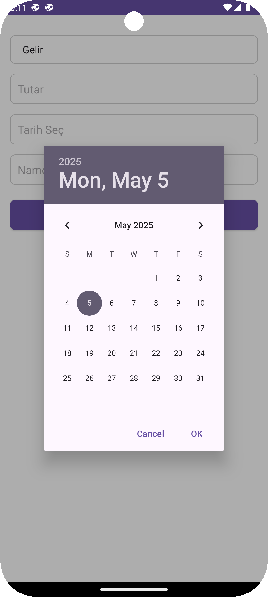
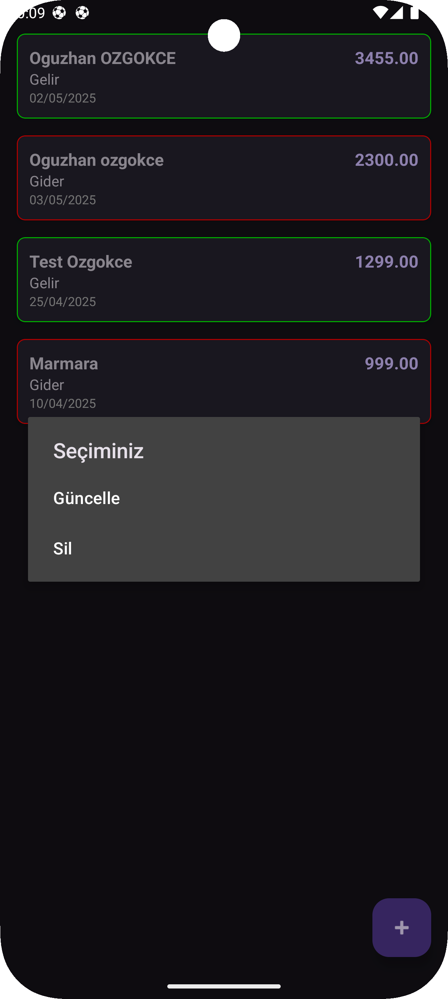

# Lab6_0505_Marmara  
**Marmara Üniversitesi – Bilgisayar Mühendisliği**  
**6. Hafta Lab Uygulaması**  

> Basit bir **Transaction** (Gelir & Gider) takip uygulaması

  

---

## 🔖 Özellikler

- **Yeni İşlem Ekleme**  
  Kişi adı, işlem türü (Gelir/Gider), tutar ve tarih girerek kayıt oluştur.  
- **Performant Listeleme**  
  `RecyclerView + ListAdapter + DiffUtil` kombinasyonu.  
- **Güncelle & Sil**  
  Kartlara uzun basınca “Güncelle” veya “Sil” seçenekleri.  
- **Dinamik Kart Renkleri**  
  “Gelir” yeşil, “Gider” kırmızı border.  
- **Modern Tasarım**  
  Material3, Edge-to-Edge ve ViewBinding ile full-screen uyumlu.

---

## 🛠️ Teknolojiler

- **Android SDK** (minSdk 27, targetSdk 35)  
- **Java 17**  
- **Room** (SQLite DAO katmanı)  
- **Hilt** (DI)  
- **MVVM** (ViewModel + LiveData)  
- **ViewBinding**  
- **RecyclerView + ListAdapter + DiffUtil**  
- **Material Components (Material3)**  

---

## 🚀 Başlarken

### Gereksinimler

- Android Studio Arctic Fox veya üstü  
- JDK 17  
- Gradle 8.x  

### Kurulum

```bash
# Repo’yu klonla
git clone https://github.com/oguzhanozgokce/Lab6_0505_Marmara.git

cd Lab6_0505_Marmara

# Derle ve çalıştır
./gradlew clean assembleDebug
